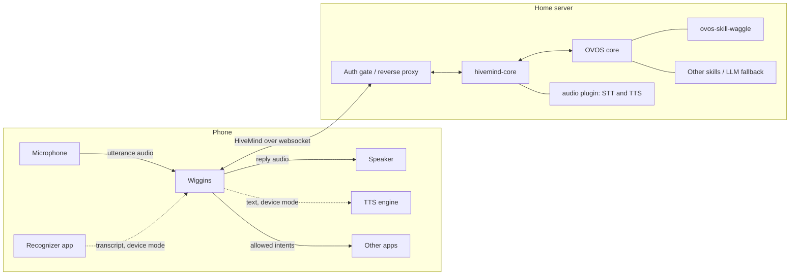

# Wiggins — HiveMind Android Client Spec

Oct 5, 2026 · Wiggins contributors

## Purpose and scope

Wiggins is an Android HiveMind client that registers as the system assistant, sends spoken requests to a HiveMind hub, speaks the replies, and launches Android intents the hub requests, within limits the user sets on the phone. It requires no Google services and is tested on GrapheneOS.

**Names.** The app is **Wiggins**, after the leader of the Baker Street Irregulars, Sherlock's errand-runners (OVOS descends from Mycroft, Sherlock's brother). The messages it uses for phone actions are the **Waggle protocol**, after the honeybee waggle dance. Waggle is defined in `ovos-skill-waggle/WAGGLE.md` and implemented on the hub by that skill.

Wiggins runs no speech models of its own. Speech-to-text and text-to-speech are each done either by the **hub** or by the **device**. With hub speech (M4), Wiggins records the utterance, the hub transcribes it, and the hub synthesizes the replies, the way a HiveMind voice relay works. With device speech, Wiggins uses apps the user already has, through standard Android intents and services. Hub speech is the main mode, because on-device recognizers and voices are usually much worse than what a hub can run. Device speech is the fallback for a hub without speech services.

Out of scope for v1: on-device wake word, on-device intent parsing, bundled STT or TTS models, streaming the microphone to the hub (for hub-side wake word), and reading or controlling the screen.

## Prerequisites

| Need | Why | Example on GrapheneOS |
| --- | --- | --- |
| A HiveMind hub (OVOS + hivemind-core) | Understanding and replies | — |
| For hub speech: the hub's `hivemind-audio-binary-protocol` plugin, with STT and TTS plugins configured | Speech-to-text and speaking replies (M4) | Plugins calling Wyoming Whisper and Piper servers |
| For device speech: a speech recognizer that handles `RecognizerIntent.ACTION_RECOGNIZE_SPEECH` | Speech-to-text | FUTO Voice Input (source-available, not OSI open source; Wiggins doesn't depend on it) |
| For device speech: a system TTS engine | Speaking replies | RHVoice, Sherpa TTS |
| Optional: ovos-skill-waggle on the hub | Phone actions (M5) | — |
| A HiveMind client key for this phone | Bus access | — |
| Optional: a UnifiedPush distributor | Hub-initiated actions (M6) | Nextcloud UnifiedPush |

Text input works with no speech set up at all, and replies are always shown as text, so Wiggins is usable before speech is set up. The setup screen checks for each prerequisite the chosen speech modes need and links to what's missing.

## Architecture

With hub speech, the phone records an utterance and sends it through the auth gate to hivemind-core, whose audio plugin transcribes it. The phone then sends the text as the question. OVOS routes it to a skill or the LLM fallback, and the hub sends back replies, which the audio plugin synthesizes, and Waggle requests, which the phone runs only as far as its allowlist permits. With device speech, the dotted paths replace the hub's STT and TTS.

## Stack

- **Language and UI:** Kotlin with coroutines and Jetpack Compose.
- **Network:** OkHttp for the websocket and mTLS; AppAuth (Apache-2.0, no Play Services) for the proxy sign-in.
- **Serialization:** kotlinx.serialization for all HiveMind and Waggle JSON; no second JSON library.
- **Storage:** Room for allowlist rules and the action log; DataStore for settings.
- **Secrets:** DataStore values encrypted with Tink under a master key held in Android Keystore. Not `androidx.security:security-crypto`, which is deprecated.
- **Crypto:** the HiveMind handshake and payload encryption use the platform JCA provider (Conscrypt). BouncyCastle is added only if the targeted hivemind-core needs a primitive the platform lacks.
- **Dependencies:** open source only, with no Google Play Services, Firebase or other proprietary libraries, and a reproducible build, so F-Droid stays an option.
- **Build:** Gradle Kotlin DSL with a version catalog.
- **API level:** minSdk 34. Any feature that needs a later API level is noted where it's specified, and is disabled on older versions rather than raising minSdk.

## Connection

- **Transport:** HiveMind over websocket, not the HTTP protocol plugin. The hub URL may be `ws://` or `wss://`. HiveMind encrypts payloads end to end either way, so `ws://` is allowed in the "none" auth mode (LAN or VPN, such as Tailscale); the mTLS and proxy-login modes require `wss://`. Waggle needs the hub to push requests, and the connection only lives while the app is in use, so a websocket's drawbacks don't apply.
- **Protocol:** the HiveMind handshake, payload encryption and message framing are implemented in Kotlin; there is no JVM HiveMind client to reuse. Target the current hivemind-core release and test against vectors generated with the Python client.
- **Lifecycle:** connect when the assistant UI or main screen opens, stay connected while it's visible and while any Waggle request is pending, then disconnect after a short idle period. Ping on an interval to keep proxies from dropping the connection; reconnect on resume.
- **Session context:** each utterance carries an OVOS session with the phone's language and timezone, so ordinary skills (time, date) answer for the phone's location. The timezone goes inside the location the hub hands back, since a sent location replaces the hub's whole one and the phone has no city or coordinates to offer (the weather skill needs them). Until the hub has handed a session back, Wiggins sends no location and the hub's applies, timezone included. Waggle timestamps are UTC on the wire.
- **Push (M6, optional):** with a UnifiedPush distributor, the hub can wake Wiggins to connect and receive a request while the UI is closed. It adds hub-initiated actions (for example a home automation opening navigation, or "ring my phone"), and nothing else. Holding the assistant role through an `ACTION_ASSIST` activity does not by itself allow background activity launches, and neither does a `shortService` foreground service. The assistant role does grant the `SYSTEM_ALERT_WINDOW` app-op to an app that declares that permission, which exempts it; failing that, Wiggins posts a notification the user taps. Both paths, and a `shortService` foreground service to hold the connection, must be proven on a GrapheneOS device first (`docs/m2-assistant-spike.md` §5).

## Voice pipeline

Understanding always happens on the hub. Speech-to-text and text-to-speech each have a setting, **Hub** or **Device** (see "Speech modes").

1. **Trigger:** Wiggins holds the Android assistant role, so the assist gesture or long-press opens its assistant panel (see "Conversation screen"). A text box is always available. It qualifies through an exported `ACTION_ASSIST` activity, as Dicio does, not a `VoiceInteractionService`, so it never registers a recognition service or changes the system's default recognizer. The role can't be requested from inside the app, so the setup screen opens the system's assistant settings. An assist invocation starts listening at once, except from a keyboard shortcut.
2. **Speech to text:** with hub STT, Wiggins records the utterance itself and the hub transcribes it (see "Hub speech-to-text"). With device STT, Wiggins starts `RecognizerIntent.ACTION_RECOGNIZE_SPEECH`, and the user's recognizer appears in the foreground and returns the transcript. Either way, Wiggins sends `recognizer_loop:record_begin` and `record_end` around listening.
3. **Uplink:** the transcript is shown as the user's bubble and goes to the hub as a `recognizer_loop:utterance` message.
4. **Reply:** the hub's `speak` messages are shown as text and read aloud, by the hub's TTS (see "Hub text-to-speech") or by Android `TextToSpeech` with the system engine. While a reply is being read, the mic button becomes a stop button. A speaker toggle in the app bar and panel turns spoken replies off (text only) until turned back on, and is remembered. With speech off, a follow-up question starts listening straight away. The volume keys control the voice's volume on Wiggins' screens.
5. **Follow-ups:** when a `speak` message expects a response, or the hub sends `mycroft.mic.listen`, Wiggins listens again after speech finishes.

### Speech modes

- **Settings:** speech-to-text and text-to-speech each have a Hub or Device setting, so a user can mix them, for example hub STT with a favourite on-device voice. Hub STT has an **Early transcription** switch, on by default (see "Hub speech-to-text").
- **Default:** the setup screen checks hub speech by asking the hub to synthesize a short phrase. The plugin can't load without both an STT and a TTS engine, so an answer means both are available. If the hub answers, both settings default to Hub. If it doesn't, they default to Device, and the setup screen says the hub has no speech services. An install upgraded from before M4 runs the check once, on its next connection.
- **Messages:** hub speech uses the JSON messages of HiveMind's `hivemind-audio-binary-protocol` plugin, the same ones `hivemind-voice-relay` uses. They are ordinary `bus` messages, so they need no binary frames (binarize stays off), and they travel over the same encrypted, authenticated connection as everything else. No speech service is exposed beyond the hub.
- **Session:** speech requests carry the conversation's session like any other message, and its language as `lang`.

### Hub speech-to-text

1. **Recording:** Wiggins records from the microphone with `AudioRecord` (source `VOICE_RECOGNITION`, 16 kHz, mono, 16-bit PCM) and takes transient audio focus, so music pauses or ducks. The mic button shows the input level and works as a stop button that ends the utterance early. Cancel, Back or closing the panel discards it.
2. **End of speech:** a voice activity detector on the phone ends the utterance after about 0.8 s of silence following at least 0.2 s of speech. If no speech starts within 8 s, Wiggins stops and sends nothing. An utterance is capped at 30 s, which keeps each message under about 2 MB on the wire. Tuning is a constant in code, not a setting.
3. **Transcription:** Wiggins wraps the audio in a WAV header and sends `recognizer_loop:b64_transcribe` with `{"audio": <base64 WAV>, "lang": ..., "sample_rate": 16000, "sample_width": 2}`, and puts a random `wiggins_id` in the message's context. The user's bubble shows "Transcribing…" until the hub answers with `recognizer_loop:b64_transcribe.response`, whose `transcriptions` is a list of `[text, confidence]` pairs. The response's data doesn't echo the request's, but the hub builds it with `Message.reply`, which copies the request's context, so Wiggins matches it by `wiggins_id` and ignores any response for a request it no longer wants. Wiggins takes the first transcription, trims it, and sends it as the utterance (pipeline step 3).
4. **Early transcription:** waiting for 0.8 s of silence and then transcribing (about 0.5 s on a CPU hub) adds the two delays together. With the switch on, Wiggins overlaps them: after 0.3 s of silence it sends the audio so far for transcription, without ending the recording. If the silence reaches 0.8 s, the utterance ends and that transcription is the result, usually already back. If speech resumes first, Wiggins discards that request's response, and repeats the step at the next pause with the longer audio. A new early request replaces any outstanding one, whose response is then ignored, so a quick pause after resumed speech never waits on stale audio. The cost is a wasted hub transcription for each mid-sentence pause. With the switch off, Wiggins transcribes only once the utterance has ended. The switch exists in case early transcription doesn't pay off in use; if it does, the switch may be removed later.
5. **Failures:** an empty transcription removes the pending bubble and shows "Didn't catch that". No answer within 15 s does the same and shows a status banner that hub speech isn't answering, with an action to switch to device speech.

Wiggins transcribes first and then sends the text, rather than sending `recognizer_loop:b64_audio` (which the hub transcribes and handles in one step). That way the user's words appear before the answer, the client's default permissions suffice, and both modes send the hub the same message.

The WAV header and the two sample fields cover both plugin versions: 2.1.x reads the base64 data as an audio file, and the 2.2 alphas read it as raw 16 kHz 16-bit PCM and check the sample fields. For 2.2 the 44-byte header is about 1 ms of noise.

### Hub text-to-speech

1. **Request:** Wiggins splits each `speak` it will read aloud into sentences, since one `speak` can be a whole paragraph that a CPU engine takes over 10 s to synthesize. For each sentence it sends `speak:b64_audio` with `{"utterance": ..., "lang": ..., "wiggins_id": <random id>}`. It requests the next sentence's audio while the current one plays, so a multi-sentence answer has no gaps. Sentences always play in the order their `speak` messages arrived, whatever order the audio comes back in.
2. **Response:** the hub replies with `speak:b64_audio.response`, whose data is the request's data plus `audio`, a base64 WAV file. Wiggins matches it to the request by `wiggins_id`, and plays the sentences in the order the `speak` messages arrived.
3. **Playback:** the WAV's PCM goes to an `AudioTrack` with assistant usage, at whatever rate and format the hub's engine produced (for example 22050 Hz, 16-bit mono for Piper). Stop, the speaker toggle and the volume keys behave as with the device engine. Wiggins takes transient audio focus while speaking.
4. **Failures:** if the audio for a sentence doesn't arrive within 10 s (plus 40 ms for each character past the first 100, for a long sentence), Wiggins speaks it with the device engine when one is installed, otherwise leaves it as text only, and shows the same status banner as for STT.

## Conversation screen

- **Assistant panel:** the assist gesture opens a panel anchored to the bottom of the screen, over whatever app is open, like other assistants, not the full app. It starts with a fresh conversation on screen that lasts only while the panel is open and isn't added to the saved one. The hub's side of the conversation (OVOS session state, a persona's chat history) is shared with the app. The panel listens straight away, as the full app did. Tapping outside it, Back, or leaving it closes it and stops any speech. A button opens the full app, which the launcher also opens, with the saved conversation.
- **One answer, one bubble:** OVOS may speak an answer a sentence at a time (a persona streaming from an LLM does). Each sentence is spoken as it arrives, and the sentences of one answer join into one bubble, which shows small rising bubbles while more may come. It's complete when the hub reports the question handled (`ovos.utterance.handled`), when a sentence asks a follow-up question, when the connection drops, or after 15 seconds without a new sentence. Speech the hub starts by itself, such as a timer going off, is a bubble of its own.
- **The conversation is what the hub remembers:** the user's utterances and the hub's replies, in one OVOS session. OVOS keeps conversation memory on the hub keyed by `session_id` (a persona's chat history, active skills), so the screen and that memory begin and end together. The session id is saved with the conversation, so an app restart continues it, and OVOS's session state is carried across reconnects. The conversation ends, clearing the screen and starting a new session (and so a new connection), when the user clears it or after 30 minutes without a question or reply: the hub can't be asked whether it still remembers a session, so idle time is the best guess at when it's stale.
- **Status is not conversation.** Connection and setup problems (not configured, wrong password, can't reach the hub, assistant role not held) are shown as status: the connection state under the title, and at most one banner naming the current problem with an action to fix it. Status reflects the current state, so it disappears when the problem is fixed, and navigating, reopening or reconnecting never adds duplicates.
- **A question that couldn't be sent** is marked on its own bubble ("Not sent", with retry) rather than as a separate error entry.

## Stock OVOS skills

Until M5, Wiggins is a plain HiveMind client: it sends utterances and handles `speak`, the follow-up messages above and, from M4, the hub speech replies. Stock skills should work as they do through any text satellite. Things to find out during M1–M3:

- **Other downlink messages:** which message types stock skills send to a satellite beyond `speak`, such as sound effects, media playback (OCP) and GUI messages. M1 logs them all; each one is then handled, ignored on purpose, or added to the spec.
- **Timers and alarms:** the stock timer and alarm skills run on the hub, so their alerts play there. Decided 2026-10-06: a request spoken to the phone is meant for the phone. ovos-skill-waggle's pipeline stage takes it ahead of the alerts skill, but only for a client that has announced `waggle.capabilities`, so other satellites keep the hub's timers (`ovos-skill-waggle/SPEC.md` "The pipeline stage").

## Phone actions (Waggle)

Waggle arrives in M5.

The full protocol, including message formats, error codes and query schemas, is in `ovos-skill-waggle/WAGGLE.md`. In short: the hub sends `waggle.intent` to launch an activity and `waggle.query` to read data; the phone answers each with a response carrying the request `id`, and announces its rules and enabled queries in `waggle.capabilities` on connect and whenever settings change. This section covers what's specific to Wiggins.

**Allowlist.** Each rule matches on action and optionally on data scheme, package and category, and says run, ask or block. The most specific matching rule wins and ties go to the stricter mode. An intent no rule matches follows the **unmatched intents** setting: block (the default) or ask. Ask lets new skill actions work, with a confirmation each time, while the phone's rules catch up with the hub. Rules and the setting are edited only on the phone, never from the hub. Wiggins ships with these defaults:

| Rule | Mode |
| --- | --- |
| `SET_ALARM`, `SET_TIMER`, `SHOW_ALARMS` | run |
| `MAIN` + `LAUNCHER` (opening apps) | run |
| `DIAL` with `tel:` | ask |
| `SENDTO` with `smsto:` / `sms:` | ask |
| Anything unmatched | block, or ask if the user enables it |

The ask card for an unmatched intent offers "Allow always", which creates a rule from it, so a drifted action needs confirming once rather than forever. The launch rules below apply whatever the mode.

**Launching.**

- Intents launch with `startActivity`. The response reports whether the launch succeeded, not what the target app did.
- Wiggins never adds hub-supplied flags and never grants URI permissions. It rejects `content:`, `file:`, `intent:` and `android-app:` URIs in `data` and in `uri` extras, and any intent that would resolve to Wiggins itself.
- Android limits activity launches from the background, and drops a refused launch without an error. With the connection tied to the UI, Wiggins is normally in the foreground when requests arrive; when no Wiggins screen is visible it doesn't try, and answers `launch_failed`.
- `ACTION_CALL` (and its privileged and emergency variants) is never supported: it answers `blocked`, whatever the rules say, so Wiggins never holds `CALL_PHONE`.
- Android only lets Wiggins see apps its manifest's `<queries>` names, so the targets of the default rules are listed there. An intent for anything else can still launch, but Wiggins can't tell in advance whether an app handles it, and may answer `no_handler`.
- Opening an app by package (`MAIN` + `LAUNCHER` + `package`) targets that app's launcher activity directly, since launcher activities usually don't accept implicit intents.

**Asking.** For an "ask" rule, Wiggins shows a confirmation card with the hub's `description` and, beneath it, the raw action, URI and target, so a hub can't disguise what it asks for. If the user doesn't answer within `ask_timeout_s` (default 15 s, announced in capabilities), it answers `timeout`. Wiggins stays connected until the card is resolved.

**Queries.** `calendar.next`, `contacts.lookup` and `apps.list` are implemented in the client. Each is off until the user enables it, which is also when Wiggins requests the matching permission. `apps.list` uses a `<queries>` entry for launcher activities, so no `QUERY_ALL_PACKAGES` permission is needed.

**Action log.** Every Waggle request is logged on the phone: time, request, the matching rule and the outcome. The log keeps the latest 500 and stays on the phone; it can be cleared.

**Where it lives.** Rules, the unmatched setting and the queries are on the Phone actions screen (the app's overflow menu), with the action log beside it. Wiggins announces `waggle.capabilities` after each connection's handshake and again whenever any of them changes. The ask card appears above the text box, in the app or the assistant panel, and a pending one keeps the connection open.

## Security requirements

Two independent layers: the network path is gated by the user's choice of auth mode, and the bus is gated by a HiveMind key with narrow permissions.

- **Auth modes (pluggable):** none (LAN or VPN), client certificate (mTLS at the reverse proxy), or sign-in, where the proxy checks an identity-provider access token. Client certificates come from Android KeyChain, either chosen there or imported from a PKCS#12 file through the system installer.
- **Sign-in (M3):** the supported example deployment is Pomerium running as a Kubernetes ingress controller (it terminates TLS for the hub's host), with Entra ID as the identity provider. Any proxy that validates an identity-provider access token on the websocket upgrade fits the same mode. Wiggins is an OAuth public client of Entra: AppAuth runs the authorization-code flow with PKCE in a browser tab, with the redirect `com.mulesipstea.wiggins://oauth2redirect`, and requests the hub API's scope plus `offline_access`, so it refreshes silently. It sends `Authorization: Bearer <access token>` on the websocket upgrade. Pomerium validates the token (`bearer_token_format: idp_access_token`, with the API as the allowed audience) and applies the route's app role (for example `hivemind.access`), then strips the header before the hub. The issuer URL, client ID and scope are settings. Policy is checked on the upgrade only, so an open connection outlives its token; the next connect refreshes it. A 401 or a redirect asks the user to sign in again, and a 403 means the account lacks the role. Pomerium's own programmatic login was rejected: it only redirects to allowlisted http(s) hosts, needs signing in again every 14 hours, and its token opens every route the user can reach. Details: `docs/m3-pomerium-auth.md`.
- **Client certificates at Pomerium:** deferred (2026-10-04) until a client that can't sign in in a browser needs remote access, such as a satellite at another site. Wiggins already supports the mode. Enabling it means a global client CA on the Pomerium CR with `enforcement: policy` (never the default `policy_with_default_deny`, which would lock certificate-less clients out of every route), plus a route policy of "role OR pinned SPKI hash". Every Pomerium host then asks for a client certificate during the handshake, so Android browsers may show a certificate picker. Details: `docs/m3-pomerium-auth.md` §5.
- **Secrets:** HiveMind credentials and tokens stored in Tink-encrypted DataStore under a Keystore-held key (see Stack).
- **Hub-side permissions:** a dedicated non-admin HiveMind client allowed to send only `recognizer_loop:utterance`, `recognizer_loop:record_begin` and `recognizer_loop:record_end`. Hub speech (M4) adds `recognizer_loop:b64_transcribe` and `speak:b64_audio`. All five are in the default `allowed_types` of hivemind-core 3.4 (stable), but newer HiveMind grants nothing by default, so set them with `hivemind-core allow-msg`. M5 adds `waggle.capabilities`, `waggle.intent.response` and `waggle.query.response`.
- **Speech audio:** with hub STT, Wiggins records only while the listening indicator shows, keeps no recordings, and sends audio only to the hub, inside the encrypted HiveMind connection. The hub passes it to its STT service, which the hub's operator chooses.
- **Phone-side permissions:** commands from the hub are untrusted. Intents run only as the allowlist permits, the launch rules above apply to every intent, and dialing or sending messages always needs a tap.
- **Android permissions:** `RECORD_AUDIO` is requested the first time hub STT listens, and device STT never needs it. `READ_CALENDAR` and `READ_CONTACTS` are requested only when their query is enabled. `SET_ALARM` is a normal permission granted at install. No `CALL_PHONE`, no AccessibilityService, no analytics.

## Testing

- **Unit:** HiveMind handshake and encryption against Python-generated test vectors; WAV encoding and parsing; end-of-speech detection against recorded fixtures (speech then silence, no speech, noise); early transcription (a pause that becomes the end, a pause followed by more speech, a late response to a discarded request, the switch off); matching TTS responses to requests and playing them in order; the allowlist matcher against the same cases as the `waggle` library's tests; intent building from Waggle JSON, including every rejection rule.
- **Integration:** hub speech against a throwaway hub container with the audio plugin enabled, using Python-generated vectors for the `b64_transcribe` and `b64_audio` messages and responses; a local hivemind-core with the `waggle` library's fake hub sending scripted Waggle requests, so the allowlist, ask card and responses are tested without a full OVOS install.
- **Manual:** on a GrapheneOS device against a hub with speech services, and, for device speech, with FUTO Voice Input and a TTS engine installed.

## Milestones

M1–M3 make Wiggins a useful client for stock OVOS skills with no Waggle at all; that is the first release. M4 replaces the on-device speech apps, which turned out to be the weakest part of the first release, with the hub's. Waggle starts once real use shows how stock skills behave through a phone.

1. **M1 — Text client:** HiveMind over websocket in Kotlin with key and password, send typed utterances, show and speak replies. Log every message type the hub sends down.
2. **M2 — Assistant:** assistant role, recognizer intent, follow-up listening, prerequisite checks. Starts with a spike on the trigger question below.
3. **M3 — Remote access:** mTLS and proxy-login modes. First release.
4. **M4 — Hub speech:** Hub and Device settings for STT and TTS, recording with end-of-speech detection, hub transcription, hub TTS playback, the setup check and `RECORD_AUDIO`. Pairs with the hub enabling `hivemind-audio-binary-protocol` with its STT and TTS plugins.
5. **M5 — Waggle:** allowlist and rule editor, ask card, action log, the three queries, capability announcement. Pairs with ovos-skill-waggle S2–S3.
6. **M6 — Push (optional):** UnifiedPush wake-up for hub-initiated actions, if the background-launch spike succeeds.

## Backlog

Work found in testing that isn't tied to a milestone yet. Tick items off here when they land.

- [x] Move connection and setup errors out of the conversation into status, per "Conversation screen". Found on the first device test (2026-10-04): error bubbles stayed after reconnecting, and opening the app before setup added a new "not configured" bubble every time.
- [x] Keep the conversation when Android kills the app (the last 200 entries, in app-private storage).
- [x] Spoken answers to a skill's follow-up question weren't understood. The cause was in Wiggins: it built a fresh session for each utterance, dropping the `utterance_states` that OVOS keeps only in the session the client hands back. Wiggins now echoes the hub's session and sends `record_begin`/`record_end` around listening. See `docs/alarm-followup-investigation.md`. Still to confirm on the phone.
- [x] Move the connection and conversation out of the activity's ViewModel into an app-scoped owner (`Assistant`).
- [ ] Test Wi-Fi ↔ mobile data handoff on the phone.
- [ ] Recognizers may write times as "6.30", which the hub's date parser doesn't read (it reads "6:30" and "six thirty"). Decide whether the hub normalizes this (an ovos-core utterance transformer) or not at all. Rewriting it in Wiggins would also change things like "3.14".
- [ ] Hub-side, optional: raise `skills.get_response_timeout` (default 20 s) in the hub's `mycroft.conf` if spoken answers still time out.
- [ ] The alerts skill parses times in the hub's timezone (from its `mycroft.conf`), not the session's. It only matters when the phone is in a different timezone from the hub; check upstream.
- [ ] Upstream cosmetic: with no duration the alerts skill starts a stopwatch and says "Timer for , starting now."
- [ ] Hub-side: ovos-persona keeps each session's chat history in memory with no expiry, cap or pruning, and sends all of it with every prompt, so a long session's prompts keep growing and abandoned sessions stay until ovos-core restarts. Wiggins ends sessions after 30 minutes idle, which bounds each session but not the leftovers. Propose an idle TTL (matching Wiggins'), a cap on remembered exchanges, and pruning to ovos-persona, and run a patched build on the hub until it lands.

## Open questions

- [x] How do satellites without their own STT and TTS get them? From the hub's `hivemind-audio-binary-protocol` plugin, as `hivemind-voice-relay` and `hivemind-mic-satellite` do. Wiggins uses its JSON messages (see "Speech modes"), not binary frames or continuous mic streaming. Researched 2026-10-05 against plugin 2.1.3 (in the hub image) and the 2.2 alphas.
- [x] End-of-speech detection: the WebRTC voice detector from `gkonovalov/android-vad` (decided 2026-10-05). Its Silero model is more accurate but adds ONNX Runtime. The library is published only on JitPack, as a prebuilt native library, which F-Droid wouldn't accept. Its repo has the full source, though, so Wiggins vendors the `webrtc` module (the Kotlin wrapper, the JNI glue and the WebRTC C code, built with `Android.mk`) as the `vad` module and builds it with a pinned NDK, for `arm64-v8a` and `x86_64` only. The NDK is added to CI and the release workflow. The MIT and BSD-3-Clause notices stay with the source and go on the About screen. Clean builds produce the same native library, from any checkout path, once `-ffile-prefix-map` and `-fdebug-compilation-dir` keep the paths out of the build ID (checked 2026-10-06; `vad/README.md`).
- [x] Which hivemind-core version, handshake and cipher should M1 target? hivemind-core 3.4.0 (hub image `stable-20260922`), password handshake, ChaCha20-Poly1305, JSON-B64, binarize off. Details and Python-generated test vectors: `docs/hivemind-protocol.md`, `tools/vectors/`.
- [x] Trigger: an `ACTION_ASSIST` activity, as Dicio does. A `VoiceInteractionService` must declare a recognition service and can take over the system's default recognizer. Background launches for M6 need `SYSTEM_ALERT_WINDOW` (granted by the role) or a notification; still to verify on GrapheneOS. See `docs/m2-assistant-spike.md`.
- [x] How does Wiggins sign in through Pomerium? With an Entra access token checked by Pomerium (see Security requirements). Programmatic login redirects only to allowlisted http(s) hosts. With `allow_websockets`, Pomerium disables the route and idle timeouts. Still to confirm live: `docs/m3-pomerium-auth.md` "Open items".
- [x] Distribution: GitHub releases, installed and updated with Obtainium, first (decided 2026-10-05). F-Droid or Accrescent may follow; the Stack's dependency rules keep F-Droid possible.
- [x] License: Apache-2.0 (decided 2026-10-04). It matches OVOS and HiveMind, so they can take code upstream, and it doesn't lean on copyright the largely AI-generated code may not have. The README says the code is largely AI-generated. Copyleft (GPL-3.0) was considered and dropped for those reasons.
