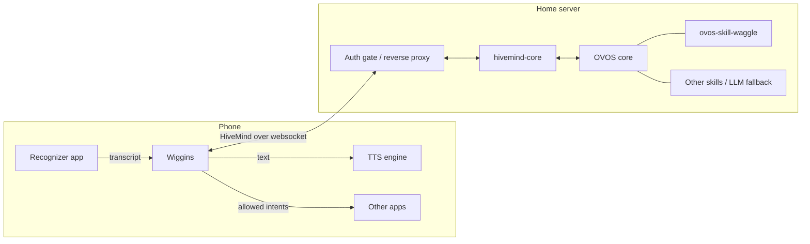

# Wiggins — HiveMind Android Client Spec

Oct 4, 2026 · Wiggins contributors

## Purpose and scope

Wiggins is an Android HiveMind client that registers as the system assistant, sends spoken requests to a HiveMind hub, speaks the replies, and launches Android intents the hub requests, within limits the user sets on the phone. It requires no Google services and is tested on GrapheneOS.

**Names.** The app is **Wiggins**, after the leader of the Baker Street Irregulars, Sherlock's errand-runners (OVOS descends from Mycroft, Sherlock's brother). The messages it uses for phone actions are the **Waggle protocol**, after the honeybee waggle dance. Waggle is defined in `ovos-skill-waggle/WAGGLE.md` and implemented on the hub by that skill.

Wiggins does no speech processing of its own. It hands speech-to-text and text-to-speech to apps the user already has, through standard Android intents and services.

Out of scope for v1: on-device wake word, on-device intent parsing, bundled STT or TTS, streaming audio to the hub, and reading or controlling the screen. A full HiveMind voice satellite (hub-side STT and TTS, wake word) may come later.

## Prerequisites

| Need | Why | Example on GrapheneOS |
| --- | --- | --- |
| A speech recognizer that handles `RecognizerIntent.ACTION_RECOGNIZE_SPEECH` | Speech-to-text | FUTO Voice Input (source-available, not OSI open source; Wiggins doesn't depend on it) |
| A system TTS engine | Speaking replies | RHVoice, Sherpa TTS |
| A HiveMind hub (OVOS + hivemind-core) | Understanding and replies | — |
| Optional: ovos-skill-waggle on the hub | Phone actions (M4) | — |
| A HiveMind client key for this phone | Bus access | — |
| Optional: a UnifiedPush distributor | Hub-initiated actions (M5) | Nextcloud UnifiedPush |

Text input works with no recognizer, and replies are always shown as text, so Wiggins is usable before the speech apps are set up. The setup screen checks for each prerequisite and links to what's missing.

## Architecture

The phone turns speech into text and sends it through the auth gate to hivemind-core. OVOS routes it to a skill or the LLM fallback, and the hub sends back spoken replies and Waggle requests, which the phone runs only as far as its allowlist permits.

## Stack

- **Language and UI:** Kotlin with coroutines and Jetpack Compose.
- **Network:** OkHttp for the websocket and mTLS; AppAuth (Apache-2.0, no Play Services) for the proxy sign-in.
- **Serialization:** kotlinx.serialization for all HiveMind and Waggle JSON; no second JSON library.
- **Storage:** Room for allowlist rules and the action log; DataStore for settings.
- **Secrets:** DataStore values encrypted with Tink under a master key held in Android Keystore. Not `androidx.security:security-crypto`, which is deprecated.
- **Crypto:** the HiveMind handshake and payload encryption use the platform JCA provider (Conscrypt). BouncyCastle is added only if the targeted hivemind-core needs a primitive the platform lacks.
- **Dependencies:** open source only, with no Google Play Services, Firebase or other proprietary libraries, and a reproducible build, so F-Droid stays an option.
- **Build:** Gradle Kotlin DSL with a version catalog.
- **API level:** minSdk 34. Any feature that needs a later API level is noted where it's specified, and is disabled on older versions rather than raising minSdk.

## Connection

- **Transport:** HiveMind over websocket, not the HTTP protocol plugin. The hub URL may be `ws://` or `wss://`. HiveMind encrypts payloads end to end either way, so `ws://` is allowed in the "none" auth mode (LAN or VPN, such as Tailscale); the mTLS and proxy-login modes require `wss://`. Waggle needs the hub to push requests, and the connection only lives while the app is in use, so a websocket's drawbacks don't apply.
- **Protocol:** the HiveMind handshake, payload encryption and message framing are implemented in Kotlin; there is no JVM HiveMind client to reuse. Target the current hivemind-core release and test against vectors generated with the Python client.
- **Lifecycle:** connect when the assistant UI or main screen opens, stay connected while it's visible and while any Waggle request is pending, then disconnect after a short idle period. Ping on an interval to keep proxies from dropping the connection; reconnect on resume.
- **Session context:** each utterance carries an OVOS session with the phone's language and timezone, so ordinary skills (time, date) answer for the phone's location. Waggle timestamps are UTC on the wire.
- **Push (M5, optional):** with a UnifiedPush distributor, the hub can wake Wiggins to connect and receive a request while the UI is closed. It adds hub-initiated actions (for example a home automation opening navigation, or "ring my phone"), and nothing else. Holding the assistant role through an `ACTION_ASSIST` activity does not by itself allow background activity launches, and neither does a `shortService` foreground service. The assistant role does grant the `SYSTEM_ALERT_WINDOW` app-op to an app that declares that permission, which exempts it; failing that, Wiggins posts a notification the user taps. Both paths, and a `shortService` foreground service to hold the connection, must be proven on a GrapheneOS device first (`docs/m2-assistant-spike.md` §5).

## Voice pipeline

Speech-to-text and TTS are the user's apps; understanding happens on the hub.

1. **Trigger:** Wiggins holds the Android assistant role, so the assist gesture or long-press opens its assistant panel (see "Conversation screen"). A text box is always available. It qualifies through an exported `ACTION_ASSIST` activity, as Dicio does, not a `VoiceInteractionService`, so it never registers a recognition service or changes the system's default recognizer. The role can't be requested from inside the app, so the setup screen opens the system's assistant settings. An assist invocation starts listening at once, except from a keyboard shortcut.
2. **Speech to text:** Wiggins starts `RecognizerIntent.ACTION_RECOGNIZE_SPEECH`, and the user's recognizer appears in the foreground and returns the transcript. Wiggins never touches the microphone, so it needs no `RECORD_AUDIO` permission.
3. **Uplink:** the transcript goes to the hub as a `recognizer_loop:utterance` message.
4. **Reply:** the hub's `speak` messages are read aloud with Android `TextToSpeech` using the system engine, and shown as text. While a reply is being read, the mic button becomes a stop button; a speaker toggle in the app bar and panel turns spoken replies off (text only) until turned back on, and is remembered. With speech off, a follow-up question opens the recognizer straight away. The volume keys control the voice's volume on Wiggins' screens.
5. **Follow-ups:** when a `speak` message expects a response, or the hub sends `mycroft.mic.listen`, Wiggins relaunches the recognizer after speech finishes.

## Conversation screen

- **Assistant panel:** the assist gesture opens a panel anchored to the bottom of the screen, over whatever app is open, like other assistants, not the full app. It starts with a fresh conversation on screen that lasts only while the panel is open and isn't added to the saved one. The hub's side of the conversation (OVOS session state, a persona's chat history) is shared with the app. The panel listens straight away, as the full app did. Tapping outside it, Back, or leaving it closes it and stops any speech. A button opens the full app, which the launcher also opens, with the saved conversation.
- **One answer, one bubble:** OVOS may speak an answer a sentence at a time (a persona streaming from an LLM does). Each sentence is spoken as it arrives, and the sentences of one answer join into one bubble, which shows small rising bubbles while more may come. It's complete when the hub reports the question handled (`ovos.utterance.handled`), when a sentence asks a follow-up question, when the connection drops, or after 15 seconds without a new sentence. Speech the hub starts by itself, such as a timer going off, is a bubble of its own.
- **The conversation is only what was said:** the user's utterances and the hub's replies. Clearing it also starts a new OVOS session (a new `session_id`, so a new connection), because OVOS keeps conversation memory on the hub keyed by session: a persona's chat history and active skills would otherwise carry on.
- **Status is not conversation.** Connection and setup problems (not configured, wrong password, can't reach the hub, assistant role not held) are shown as status: the connection state under the title, and at most one banner naming the current problem with an action to fix it. Status reflects the current state, so it disappears when the problem is fixed, and navigating, reopening or reconnecting never adds duplicates.
- **A question that couldn't be sent** is marked on its own bubble ("Not sent", with retry) rather than as a separate error entry.

## Stock OVOS skills

Until M4, Wiggins is a plain HiveMind client: it sends utterances and handles `speak` and the follow-up messages above. Stock skills should work as they do through any text satellite. Things to find out during M1–M3:

- **Other downlink messages:** which message types stock skills send to a satellite beyond `speak`, such as sound effects, media playback (OCP) and GUI messages. M1 logs them all; each one is then handled, ignored on purpose, or added to the spec.
- **Timers and alarms:** the stock timer and alarm skills run on the hub. Whether their alert reaches the phone, or only plays on the hub, decides how much ovos-skill-waggle's alarm and timer handlers matter.

## Phone actions (Waggle)

Waggle arrives in M4.

The full protocol, including message formats, error codes and query schemas, is in `ovos-skill-waggle/WAGGLE.md`. In short: the hub sends `waggle.intent` to launch an activity and `waggle.query` to read data; the phone answers each with a response carrying the request `id`, and announces its rules and enabled queries in `waggle.capabilities` on connect and whenever settings change. This section covers what's specific to Wiggins.

**Allowlist.** Each rule matches on action and optionally on data scheme, package and category, and says run, ask or block. The most specific matching rule wins and ties go to the stricter mode. An intent no rule matches follows the **unmatched intents** setting: block (the default) or ask. Ask lets new skill actions work, with a confirmation each time, while the phone's rules catch up with the hub. Rules and the setting are edited only on the phone, never from the hub. Wiggins ships with these defaults:

| Rule | Mode |
| --- | --- |
| `SET_ALARM`, `SET_TIMER`, `SHOW_ALARMS` | run |
| `MAIN` + `LAUNCHER` (opening apps) | run |
| `DIAL` with `tel:` | ask |
| `SENDTO` with `smsto:` / `sms:` | ask |
| Anything unmatched | block, or ask if the user enables it |

The ask card for an unmatched intent offers "Allow always", which creates a rule from it, so a drifted action needs confirming once rather than forever. The launch rules below apply whatever the mode.

**Launching.**

- Intents launch with `startActivity`. The response reports whether the launch succeeded, not what the target app did.
- Wiggins never adds hub-supplied flags and never grants URI permissions. It rejects `content:`, `file:`, `intent:` and `android-app:` URIs in `data` and in `uri` extras, and any intent that would resolve to Wiggins itself.
- Android limits activity launches from the background. With the connection tied to the UI, Wiggins is normally in the foreground when requests arrive; a launch that Android refuses returns `launch_failed`.
- `ACTION_CALL` is never supported, so Wiggins never holds `CALL_PHONE`.

**Asking.** For an "ask" rule, Wiggins shows a confirmation card with the hub's `description` and, beneath it, the raw action, URI and target, so a hub can't disguise what it asks for. If the user doesn't answer within `ask_timeout_s` (default 15 s, announced in capabilities), it answers `timeout`. Wiggins stays connected until the card is resolved.

**Queries.** `calendar.next`, `contacts.lookup` and `apps.list` are implemented in the client. Each is off until the user enables it, which is also when Wiggins requests the matching permission. `apps.list` uses a `<queries>` entry for launcher activities, so no `QUERY_ALL_PACKAGES` permission is needed.

**Action log.** Every Waggle request is logged on the phone: time, request, the matching rule and the outcome. The log stays on the phone and can be cleared.

## Security requirements

Two independent layers: the network path is gated by the user's choice of auth mode, and the bus is gated by a HiveMind key with narrow permissions.

- **Auth modes (pluggable):** none (LAN or VPN), client certificate (mTLS at the reverse proxy), or sign-in, where the proxy checks an identity-provider access token. Client certificates come from Android KeyChain, either chosen there or imported from a PKCS#12 file through the system installer.
- **Sign-in (M3):** the supported example deployment is Pomerium running as a Kubernetes ingress controller (it terminates TLS for the hub's host), with Entra ID as the identity provider. Any proxy that validates an identity-provider access token on the websocket upgrade fits the same mode. Wiggins is an OAuth public client of Entra: AppAuth runs the authorization-code flow with PKCE in a browser tab, with the redirect `com.mulesipstea.wiggins://oauth2redirect`, and requests the hub API's scope plus `offline_access`, so it refreshes silently. It sends `Authorization: Bearer <access token>` on the websocket upgrade. Pomerium validates the token (`bearer_token_format: idp_access_token`, with the API as the allowed audience) and applies the route's app role (for example `hivemind.access`), then strips the header before the hub. The issuer URL, client ID and scope are settings. Policy is checked on the upgrade only, so an open connection outlives its token; the next connect refreshes it. A 401 or a redirect asks the user to sign in again, and a 403 means the account lacks the role. Pomerium's own programmatic login was rejected: it only redirects to allowlisted http(s) hosts, needs signing in again every 14 hours, and its token opens every route the user can reach. Details: `docs/m3-pomerium-auth.md`.
- **Client certificates at Pomerium:** deferred (2026-10-04) until a client that can't sign in in a browser needs remote access, such as a satellite at another site. Wiggins already supports the mode. Enabling it means a global client CA on the Pomerium CR with `enforcement: policy` (never the default `policy_with_default_deny`, which would lock certificate-less clients out of every route), plus a route policy of "role OR pinned SPKI hash". Every Pomerium host then asks for a client certificate during the handshake, so Android browsers may show a certificate picker. Details: `docs/m3-pomerium-auth.md` §5.
- **Secrets:** HiveMind credentials and tokens stored in Tink-encrypted DataStore under a Keystore-held key (see Stack).
- **Hub-side permissions:** a dedicated non-admin HiveMind client whose only allowed message type is `recognizer_loop:utterance`. M4 adds `waggle.capabilities`, `waggle.intent.response` and `waggle.query.response`.
- **Phone-side permissions:** commands from the hub are untrusted. Intents run only as the allowlist permits, the launch rules above apply to every intent, and dialing or sending messages always needs a tap.
- **Android permissions:** `READ_CALENDAR` and `READ_CONTACTS` are requested only when their query is enabled. `SET_ALARM` is a normal permission granted at install. No `RECORD_AUDIO`, no `CALL_PHONE`, no AccessibilityService, no analytics.

## Testing

- **Unit:** HiveMind handshake and encryption against Python-generated test vectors; the allowlist matcher against the same cases as the `waggle` library's tests; intent building from Waggle JSON, including every rejection rule.
- **Integration:** a local hivemind-core with the `waggle` library's fake hub sending scripted Waggle requests, so the allowlist, ask card and responses are tested without a full OVOS install.
- **Manual:** on a GrapheneOS device with FUTO Voice Input and a TTS engine installed.

## Milestones

M1–M3 make Wiggins a useful client for stock OVOS skills with no Waggle at all; that is the first release. Waggle starts once real use shows how stock skills behave through a phone.

1. **M1 — Text client:** HiveMind over websocket in Kotlin with key and password, send typed utterances, show and speak replies. Log every message type the hub sends down.
2. **M2 — Assistant:** assistant role, recognizer intent, follow-up listening, prerequisite checks. Starts with a spike on the trigger question below.
3. **M3 — Remote access:** mTLS and proxy-login modes. First release.
4. **M4 — Waggle:** allowlist and rule editor, ask card, action log, the three queries, capability announcement. Pairs with ovos-skill-waggle S2–S3.
5. **M5 — Push (optional):** UnifiedPush wake-up for hub-initiated actions, if the background-launch spike succeeds.

## Backlog

Work found in testing that isn't tied to a milestone yet. Tick items off here when they land.

- [x] Move connection and setup errors out of the conversation into status, per "Conversation screen". Found on the first device test (2026-10-04): error bubbles stayed after reconnecting, and opening the app before setup added a new "not configured" bubble every time.
- [x] Keep the conversation when Android kills the app (the last 200 entries, in app-private storage).
- [x] Spoken answers to a skill's follow-up question weren't understood. The cause was in Wiggins: it built a fresh session for each utterance, dropping the `utterance_states` that OVOS keeps only in the session the client hands back. Wiggins now echoes the hub's session and sends `record_begin`/`record_end` around listening. See `docs/alarm-followup-investigation.md`. Still to confirm on the phone.
- [x] Move the connection and conversation out of the activity's ViewModel into an app-scoped owner (`Assistant`).
- [ ] Test Wi-Fi ↔ mobile data handoff on the phone.
- [ ] Recognizers may write times as "6.30", which the hub's date parser doesn't read (it reads "6:30" and "six thirty"). Decide whether the hub normalizes this (an ovos-core utterance transformer) or not at all. Rewriting it in Wiggins would also change things like "3.14".
- [ ] Hub-side, optional: raise `skills.get_response_timeout` (default 20 s) in the hub's `mycroft.conf` if spoken answers still time out.
- [ ] The alerts skill parses times in the hub's timezone (from its `mycroft.conf`), not the session's. It only matters when the phone is in a different timezone from the hub; check upstream.
- [ ] Upstream cosmetic: with no duration the alerts skill starts a stopwatch and says "Timer for , starting now."

## Open questions

- [x] Which hivemind-core version, handshake and cipher should M1 target? hivemind-core 3.4.0 (hub image `stable-20260922`), password handshake, ChaCha20-Poly1305, JSON-B64, binarize off. Details and Python-generated test vectors: `docs/hivemind-protocol.md`, `tools/vectors/`.
- [x] Trigger: an `ACTION_ASSIST` activity, as Dicio does. A `VoiceInteractionService` must declare a recognition service and can take over the system's default recognizer. Background launches for M5 need `SYSTEM_ALERT_WINDOW` (granted by the role) or a notification; still to verify on GrapheneOS. See `docs/m2-assistant-spike.md`.
- [x] How does Wiggins sign in through Pomerium? With an Entra access token checked by Pomerium (see Security requirements). Programmatic login redirects only to allowlisted http(s) hosts. With `allow_websockets`, Pomerium disables the route and idle timeouts. Still to confirm live: `docs/m3-pomerium-auth.md` "Open items".
- [x] Distribution: GitHub releases, installed and updated with Obtainium, first (decided 2026-10-05). F-Droid or Accrescent may follow; the Stack's dependency rules keep F-Droid possible.
- [x] License: Apache-2.0 (decided 2026-10-04). It matches OVOS and HiveMind, so they can take code upstream, and it doesn't lean on copyright the largely AI-generated code may not have. The README says the code is largely AI-generated. Copyleft (GPL-3.0) was considered and dropped for those reasons.
